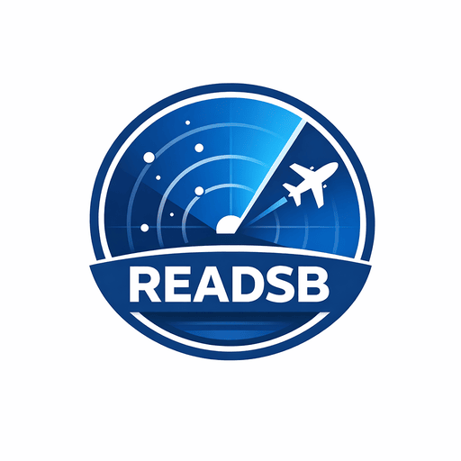

# blackoutsecure/readsb



[](https://linuxserver.io/discord)
[](https://github.com/blackoutsecure/docker-readsb/releases)
[](https://www.gnu.org/licenses/gpl-3.0)

Unofficial community image for [readsb](https://github.com/wiedehopf/readsb), built with [LinuxServer.io](https://linuxserver.io/) style container patterns (s6, hardened defaults, practical runtime options) for RTL-SDR ADS-B workloads.

This repository is not an official LinuxServer.io image release.

Sponsored and maintained by [Blackout Secure](https://blackoutsecure.app).

---

## Table of Contents

- [Quick Start](#quick-start)
- [Image Availability](#image-availability)
- [About The readsb Application](#about-the-readsb-application)
- [Supported Architectures](#supported-architectures)
- [Usage](#usage)
  - [Docker Compose](#docker-compose-recommended-click-here-for-more-info)
  - [Docker CLI](#docker-cli-click-here-for-more-info)
  - [Balena Deployment](#balena-deployment)
- [Parameters](#parameters)
- [Configuration](#configuration)
- [Application Setup](#application-setup)
- [Troubleshooting](#troubleshooting)
- [Release & Versioning](#release--versioning)
- [Support & Contributing](#support--contributing)
- [Building Locally](#building-locally)
- [References](#references)

---

## Quick Start

**5-minute RTL-SDR receiver setup:**

```bash
docker run -d \
  --name=readsb \
  --restart unless-stopped \
  -e TZ=Etc/UTC \
  -e READSB_ARGS="--net --device-type rtlsdr" \
  -p 30001:30001 \
  -p 30002:30002 \
  -p 30003:30003 \
  -p 30004:30004 \
  -p 30005:30005 \
  -p 30104:30104 \
  -v readsb-config:/config \
  -v readsb-json:/run/readsb \
  --device=/dev/bus/usb:/dev/bus/usb \
  blackoutsecure/readsb:latest
```

Access live JSON output: `docker exec readsb cat /run/readsb/aircraft.json | jq .`

For compose files, balena, network-only mode, and more examples, see [Usage](#usage) below.

---

## Image Availability

**Docker Hub (Recommended):**

- All images published to [Docker Hub](https://hub.docker.com/r/blackoutsecure/readsb)
- Simple pull command: `docker pull blackoutsecure/readsb:latest`
- Multi-arch support: amd64, arm64
- No registry prefix needed (defaults to Docker Hub)

```bash
# Pull latest
docker pull blackoutsecure/readsb

# Pull specific version
docker pull blackoutsecure/readsb:1.2.3

# Pull architecture-specific (rarely needed)
docker pull blackoutsecure/readsb:latest@amd64
```

---

## About The readsb Application

[readsb](https://github.com/wiedehopf/readsb) is an ADS-B decoder often described upstream as an "ADS-B decoder swiss knife".

It is a detached fork lineage used by many ADS-B receivers and related tooling, with network outputs, JSON/API features, and broad SDR support used for local receivers and large-scale feed/aggregation workflows.

Author and maintenance credits (upstream):

- Primary upstream maintainer: [wiedehopf](https://github.com/wiedehopf) (Matthias Wirth)
- Upstream credits/history lineage: antirez (original dump1090), Malcom Robb, mutability (dump1090-mutability / dump1090-fa), Mictronics (readsb fork), and wiedehopf (current fork)
- Upstream repository and documentation: [wiedehopf/readsb](https://github.com/wiedehopf/readsb)

---

## Supported Architectures

This image is published as a multi-arch manifest. Pulling `blackoutsecure/readsb:latest` retrieves the correct image for your host architecture.

The architectures supported by this image are:

| Architecture | Tag |
| :----: | --- |
| x86-64 | amd64-latest |
| arm64 | arm64v8-latest |

---

## Usage

### docker-compose (recommended, [click here for more info](https://docs.linuxserver.io/general/docker-compose))

```yaml
---
services:
  readsb:
    image: blackoutsecure/readsb:latest
    container_name: readsb
    environment:
      - TZ=Etc/UTC
      - READSB_USER=root
      - READSB_ARGS=--net --device-type rtlsdr --gain auto
    volumes:
      - /path/to/readsb/config:/config
      - /path/to/readsb/json:/run/readsb
    ports:
      - 30001:30001  # Raw protocol (TCP)
      - 30002:30002  # Raw protocol input (TCP)
      - 30003:30003  # SBS protocol (TCP)
      - 30004:30004  # Beast protocol (TCP)
      - 30005:30005  # Beast input (TCP)
      - 30104:30104  # JSON protocol (TCP)
    devices:
      - /dev/bus/usb:/dev/bus/usb  # RTL-SDR device
    restart: unless-stopped
    read_only: false
    tmpfs:
      - /tmp
      - /run
```

### docker-compose with RTL-SDR over network (e.g., from a remote receiver)

```yaml
---
services:
  readsb:
    image: blackoutsecure/readsb:latest
    container_name: readsb
    environment:
      - TZ=Etc/UTC
      - READSB_USER=root
      - READSB_ARGS=--net --lon <longitude> --lat <latitude>
    volumes:
      - /path/to/readsb/config:/config
      - /path/to/readsb/json:/run/readsb
    ports:
      - 30001:30001
      - 30002:30002
      - 30003:30003
      - 30004:30004
      - 30005:30005
      - 30104:30104
    restart: unless-stopped
    read_only: false
    tmpfs:
      - /tmp
      - /run
```

### docker-cli ([click here for more info](https://docs.docker.com/engine/reference/commandline/cli/))

```bash
docker run -d \
  --name=readsb \
  -e TZ=Etc/UTC \
  -e READSB_USER=root \
  -e READSB_ARGS="--net --device-type rtlsdr --gain auto" \
  -p 30001:30001 \
  -p 30002:30002 \
  -p 30003:30003 \
  -p 30004:30004 \
  -p 30005:30005 \
  -p 30104:30104 \
  -v /path/to/readsb/config:/config \
  -v /path/to/readsb/json:/run/readsb \
  --device=/dev/bus/usb:/dev/bus/usb \
  --read-only=false \
  --user root \
  --tmpfs /tmp \
  --tmpfs /run \
  --restart unless-stopped \
  blackoutsecure/readsb:latest
```

### Balena Deployment

This image can be deployed to Balena-powered IoT devices. Use the included `balena-compose.yml` file for deployment:

```bash
balena push <your-fleet-name>
```

The balena-compose configuration includes:

- Privileged access and host networking for RTL-SDR USB device access
- Kernel modules and firmware support via Balena labels
- D-Bus and Supervisor API features for system integration

Key Balena features enabled:

- `io.balena.features.kernel-modules: '1'` - RTL-SDR kernel driver support
- `io.balena.features.firmware: '1'` - Firmware loading capability  
- `network_mode: host` - Direct hardware access
- `privileged: true` - Full device access for USB SDR

For more information on Balena deployment, see the [Balena documentation](https://docs.balena.io/).

### Balena Block Publication

This project is registered as a public Balena Block and is available on [balenaHub](https://hub.balena.io/blocks).

#### For Block Maintainers

To release new versions of this block:

```bash
# Push a new release
balena push <block-name>
```

Release management is handled via the Balena Dashboard:

- New releases are tracked and can be set as default
- Each release can be pinned or set to track latest
- Manage block visibility in Settings (toggle to make public)

#### For Block Users

To use this block in your Balena fleet, add it to your `docker-compose.yml`:

```yaml
services:
  readsb:
    image: bh.cr/balenablocks/readsb-aarch64
    privileged: true
    network_mode: host
    environment:
      - TZ=Etc/UTC
      - READSB_ARGS=--net --device-type rtlsdr --gain auto
    volumes:
      - config:/config
    devices:
      - /dev/bus/usb:/dev/bus/usb
    ports:
      - "30001:30001"
      - "30002:30002"
      - "30003:30003"
      - "30004:30004"
      - "30005:30005"
      - "30104:30104"
    restart: unless-stopped
```

Available image references:

- `bh.cr/balenablocks/readsb-aarch64` - Latest aarch64 (ARM 64-bit)
- `bh.cr/balenablocks/readsb-aarch64:1.0.0` - Specific version (aarch64)
- `bh.cr/balenablocks/readsb-amd64` - Latest amd64 (x86-64)

---

## Parameters

Containers are configured using parameters passed at runtime (such as those above). These parameters are separated by a colon and indicate `<external>:<internal>` respectively. For example, `-p 8080:80` would expose port `80` from inside the container to be accessible from the host's IP on port `8080` outside the container.

| Parameter | Function |
| :----: | --- |
| `-p 30001:30001` | Raw protocol output (TCP) |
| `-p 30002:30002` | Raw protocol input (TCP) |
| `-p 30003:30003` | SBS protocol compatible output (TCP) |
| `-p 30004:30004` | Beast protocol output (TCP) |
| `-p 30005:30005` | Beast protocol input (TCP) |
| `-p 30104:30104` | JSON protocol output (TCP) |
| `-e TZ=Etc/UTC` | specify a timezone to use, see this [list](https://en.wikipedia.org/wiki/List_of_tz_database_time_zones#List). |
| `-e READSB_USER=root` | Default user. Root is recommended for USB RTL-SDR compatibility. |
| `-e READSB_ARGS=` | Additional arguments for readsb (see Application Setup) |
| `-e PUID=911` | Optional UserID when `READSB_USER` is set to a non-root user. |
| `-e PGID=911` | Optional GroupID when `READSB_USER` is set to a non-root user. |
| `-v /config` | Configuration directory for database and persistent data |
| `-v /run/readsb` | JSON output directory |
| `--device=/dev/bus/usb:/dev/bus/usb` | RTL-SDR USB device access |
| `--read-only=false` | Default mode. Recommended for most RTL-SDR USB deployments. |
| `--user root` | Default user for reliable USB device access. |

---

## Configuration

### Environment Variables from Files (Docker Secrets)

You can set any environment variable from a file by using a special prepend `FILE__`.

As an example:

```bash
-e FILE__MYVAR=/run/secrets/mysecretvariable
```

Will set the environment variable `MYVAR` based on the contents of the `/run/secrets/mysecretvariable` file.

---

---

## Umask for Running Applications

For all of our images we provide the ability to override the default umask settings for services started within the containers using the optional `-e UMASK=022` setting. Keep in mind umask is not chmod; it subtracts from permissions based on its value, it does not add permissions. See the [umask documentation](https://en.wikipedia.org/wiki/Umask) for details.

---

## User / Group Identifiers

By default, this container runs as `root` (`READSB_USER=root`) for best USB RTL-SDR compatibility.

In root mode, you do not need to set `PUID` or `PGID`.

If you choose non-root operation, set `READSB_USER` to your target username and provide matching `PUID` and `PGID`.

If you set `READSB_USER=abc` and omit `PUID`/`PGID`, the runtime defaults to `911:911`.

In this instance `PUID=1000` and `PGID=1000`, to find yours use `id your_user` as below:

```bash
id your_user
```

Example output:

```text
uid=1000(your_user) gid=1000(your_user) groups=1000(your_user)
```

---

## Application Setup

The container is pre-configured to run readsb with network support enabled. By default, it will:

- Listen for RTL-SDR devices and attempt auto-detection
- Output ADS-B data in multiple protocol formats to exposed ports
- Write JSON-formatted output to `/run/readsb/` for consumption by other applications
- Apply automatic gain control (AGC)
- Use jemalloc for improved memory efficiency

### Port Descriptions

- **30001**: Raw protocol output (TCP) - 8-bit binary messages
- **30002**: Raw protocol input (TCP) - Allows remote input of Mode S messages
- **30003**: SBS protocol output (TCP) - Compatible with aircraft tracking software like PlanePlotter and VirtualRadar
- **30004**: Beast protocol output (TCP) - Compact binary protocol with timestamps
- **30005**: Beast protocol input (TCP) - Allows remote Beast protocol input
- **30104**: JSON protocol output (TCP) - JSON-formatted ADS-B data suitable for web applications

### RTL-SDR Device Setup

To use an RTL-SDR USB dongle:

1. Pass the USB device(s) to the container: `--device=/dev/bus/usb:/dev/bus/usb`
2. Optionally modify `READSB_ARGS` to set specific RTL-SDR parameters

### Customizing readsb Arguments

The `READSB_ARGS` environment variable allows you to customize readsb behavior:

### READSB_ARGS Breakdown

Defaults in this table mean behavior when that specific item is omitted from your `READSB_ARGS` value.

| Item | Required/Optional | Default Value | Description |
| --- | --- | --- | --- |
| `--net` | Optional (recommended) | Disabled | Enables network services (inputs/outputs) for readsb. |
| `--device-type rtlsdr` | Conditionally required (local RTL-SDR input) | No SDR device selected (none) | Selects RTL-SDR as the local receiver source. Remove for network-only operation. |
| `--gain auto` | Optional | Auto gain (for `--device-type rtlsdr`) | Uses automatic tuner gain selection for RTL-SDR. |
| `--write-json /run/readsb` | Optional (recommended) | `/run/readsb` | Writes JSON output files used by local web/consumer tools into `/run/readsb`. |
| `--write-json-every 1` | Optional | 1 second | JSON output interval in seconds. 1 provides near-real-time updates. |
| `--db-file /usr/local/share/tar1090/aircraft.csv.gz` | Optional (recommended) | `/usr/local/share/tar1090/aircraft.csv.gz` | Uses the bundled tar1090 aircraft database for enriched aircraft metadata. |

```bash
# Set fixed gain (in dB)
-e READSB_ARGS="--net --device-type rtlsdr --gain 40"

# Add frequency correction (in PPM)
-e READSB_ARGS="--net --device-type rtlsdr --freq-correction 10 --gain auto"

# Set location for aircraft range calculations
-e READSB_ARGS="--net --device-type rtlsdr --lat 51.5 --lon -0.1"

# Include ICAO filtering
-e READSB_ARGS="--net --device-type rtlsdr --mode-ac-auto"

# Full example with multiple options
-e READSB_ARGS="--net --device-type rtlsdr --gain auto --lat 51.5 --lon -0.1 --max-range 350"
```

For a comprehensive list of available options, see the [readsb documentation](https://github.com/wiedehopf/readsb).

### JSON Output

The container outputs JSON data to `/run/readsb/`. This directory contains:

- `aircraft.json` - Current aircraft data with positions, callsigns, and altitudes
- `receiver.json` - Statistics and receiver information

These files are updated frequently and can be consumed by visualization tools or other applications.

### Database and Persistent Data

The `/config` volume stores:

- Aircraft database (aircraft.csv.gz)
- Application state and caches
- Any custom configuration files

### Using with tar1090

The container includes the [tar1090 aircraft database](https://github.com/wiedehopf/tar1090-db) for accurate aircraft identification. This database is automatically updated with container updates.

### Read-Only Operation

This image can be run with a read-only container filesystem. For details please [read the docs](https://docs.linuxserver.io/misc/read-only/).

#### Read-Only Caveats

- JSON output directory must be mounted to a host path or tmpfs
- Temporary directories must be writable (typically via tmpfs mount)

### Non-Root Operation

This image can be run with a non-root user. For details please [read the docs](https://docs.linuxserver.io/misc/non-root/).

#### Non-Root Caveats

- RTL-SDR device access requires proper permissions for the user
- JSON output directory must be writable by the non-root user

### Default Runtime Mode

By default this image now runs as `root` and with `read_only: false` to maximize RTL-SDR USB compatibility out of the box.

---

## Docker Mods

[Docker Mods](https://mods.linuxserver.io/) | [Docker Universal Mods](https://mods.linuxserver.io/?mod=universal)

We publish various [Docker Mods](https://github.com/linuxserver/docker-mods) to enable additional functionality within the containers. The list of Mods available for this image (if any) as well as universal mods that can be applied to any one of our images can be accessed via the links above.

---

## Troubleshooting

### Container won't start or exits immediately

**Check logs:**

```bash
docker logs readsb
docker logs readsb --tail 50 -f  # Follow last 50 lines
```

**Common causes:**

- USB device not found: Verify RTL-SDR dongle is connected and restart container
- Permission denied on `/dev/bus/usb`: Container may need elevated privileges or device permissions
- Configuration error: Check `READSB_ARGS` syntax against [Application Setup](#customizing-readsb-arguments)

### No aircraft data appearing

**Verify connectivity:**

```bash
docker exec readsb cat /run/readsb/aircraft.json | jq '.aircraft | length'
```

**If count is 0:**

- Check RTL-SDR device: `docker exec readsb rtl_test -t`
- Verify antenna is connected and positioned properly
- Check gain settings: Try `--gain 35` instead of `--gain auto` if auto-gain isn't working
- Look for RF interference: Try a different location or antenna orientation

### JSON output not updating

**Check if readsb is running:**

```bash
docker exec readsb ps aux | grep readsb
```

**Verify write permissions:**

```bash
docker exec readsb ls -la /run/readsb/
```

JSON directory should be writable by the container user.

### High CPU usage or memory growth

**Profile the container:**

```bash
docker stats readsb --no-stream
```

**Troubleshooting steps:**

- Reduce JSON output frequency: Add `--write-json-every 5` (updates every 5 seconds instead of 1)
- Check for decode storms: Monitor aircraft count with `watch 'docker exec readsb jq .aircraft.length /run/readsb/aircraft.json'`
- Restart container: `docker restart readsb`

### Device permission errors (non-root mode)

If running with `READSB_USER` set to a non-root user:

```bash
# Find the numeric user/group ID
docker exec readsb id

# Grant USB access to the group (host-side)
sudo usermod -a -G plugdev <username>
```

Then restart container with proper `PUID` and `PGID` environment variables.

### Port conflicts

If ports are already in use, map to different host ports:

```bash
docker run ... \
  -p 30011:30001 \
  -p 30012:30002 \
  -p 30013:30003 \
  ...
```

Then update client connections to use the new ports.

### Getting help

- Check [upstream readsb documentation](https://github.com/wiedehopf/readsb)
- Review container logs: `docker logs -f readsb`
- Open an issue on [GitHub](https://github.com/blackoutsecure/docker-readsb/issues)

---

## Release & Versioning

### Versioning Scheme

This project uses [semantic versioning](https://semver.org/) (MAJOR.MINOR.PATCH):

- **MAJOR**: Significant changes to container behavior or incompatible upstream updates
- **MINOR**: New features, non-breaking improvements
- **PATCH**: Bug fixes, security patches, build optimizations

Release tags are published on [GitHub Releases](https://github.com/blackoutsecure/docker-readsb/releases).

### Release Automation

When a new GitHub Release is created:

1. **Multi-arch images built** - amd64 and arm64 automatically compiled
2. **Images tagged** - Semantic version tags pushed to registry (e.g., `1.2.3`, `1.2`, `1`, `latest`)
3. **Release notes generated** - Build metadata, upstream version, usage examples included
4. **Upstream notified** - Issue created on [wiedehopf/readsb](https://github.com/wiedehopf/readsb) for visibility

### Checking Your Version

```bash
# Container version label
docker inspect -f '{{ index .Config.Labels "build_version" }}' readsb

# Image version from registry
docker inspect ghcr.io/blackoutsecure/readsb:latest | jq '.[0].Config.Labels.build_version'

# Full image details
docker image inspect blackoutsecure/readsb:latest
```

### Updating to Latest Release

```bash
docker pull blackoutsecure/readsb:latest
docker-compose up -d  # If using compose
# OR
docker stop readsb && docker rm readsb  # Remove old version
docker run ... ghcr.io/blackoutsecure/readsb:latest  # Start new version
```

---

## Support & Contributing

### Getting Help

- **Issues & Bug Reports:** [GitHub Issues](https://github.com/blackoutsecure/docker-readsb/issues)
- **Upstream readsb:** [wiedehopf/readsb documentation](https://github.com/wiedehopf/readsb)
- **LinuxServer.io patterns:** [LinuxServer.io Documentation](https://docs.linuxserver.io/)

### Reporting Issues

Please include:

- Docker/docker-compose version: `docker --version`
- Container logs: `docker logs readsb`
- Environment variables in use
- Hardware setup (RTL-SDR model, antenna type, location)
- Exact reproduction steps

### Contributing

Community contributions are welcome! Consider:

- Testing and reporting bugs
- Suggesting improvements or features
- Contributing documentation or examples
- Upstream readsb project contributions

### Community

- **Discord:** [LinuxServer.io Community](https://linuxserver.io/discord)
- **GitHub:** [Discussion & Issues](https://github.com/blackoutsecure/docker-readsb)
- **Upstream Community:** [readsb Discussion Board](https://github.com/wiedehopf/readsb/discussions)

---

## Support Info

- Sponsored and maintained by [Blackout Secure](https://blackoutsecure.app).
- Image classification: unofficial community image (LinuxServer.io-style implementation).
- Shell access whilst the container is running: `docker exec -it readsb /bin/bash`
- To monitor the logs of the container in realtime: `docker logs -f readsb`
- Container version number: `docker inspect -f '{{ index .Config.Labels "build_version" }}' readsb`
- Image version number: `docker inspect -f '{{ index .Config.Labels "build_version" }}' blackoutsecure/readsb:latest`

---

## Upstream Listing Template

Suggested line item for an issue/PR on the upstream readsb project:

- **Unofficial Community Image:** Blackout Secure maintains a LinuxServer.io-style community container for readsb with hardened defaults, s6 supervision, and RTL-SDR support: [blackoutsecure/docker-readsb](https://github.com/blackoutsecure/docker-readsb).

Community listing request:

- If approved by upstream maintainers, please add this project as an unofficial community container image for readsb.

---

## Updating Info

Images are versioned and should be updated by pulling a new image and recreating the container, rather than updating software inside a running container.

Below are the instructions for updating containers:

### Via Docker Compose

- Update images:
  - All images: `docker-compose pull`
  - Single image: `docker-compose pull readsb`
- Update containers:
  - All containers: `docker-compose up -d`
  - Single container: `docker-compose up -d readsb`
- You can also remove the old dangling images: `docker image prune`

### Via Docker Run

- Update the image: `docker pull blackoutsecure/readsb:latest`
- Stop the running container: `docker stop readsb`
- Delete the container: `docker rm readsb`
- Recreate a new container with the same docker run parameters as instructed above (if mapped correctly to a host folder, your `/config` folder and settings will be preserved)
- You can also remove the old dangling images: `docker image prune`

### Image Update Notifications - Diun (Docker Image Update Notifier)

We recommend [Diun](https://crazymax.dev/diun/) for update notifications. Other tools that automatically update containers unattended are not recommended or supported.

---

## Building Locally

If you want to make local modifications to these images for development purposes or just to customize the logic:

Build-time source defaults:

- READSB_REPO_URL=[https://github.com/wiedehopf/readsb](https://github.com/wiedehopf/readsb)
- READSB_REPO_BRANCH=dev

You can override these at build time if you want to test another fork or branch.

```bash
git clone https://github.com/blackoutsecure/docker-readsb.git
cd docker-readsb
docker build \
  --no-cache \
  --pull \
  --build-arg READSB_REPO_URL=https://github.com/wiedehopf/readsb \
  --build-arg READSB_REPO_BRANCH=dev \
  -t ghcr.io/blackoutsecure/readsb:latest .
```

The ARM variants can be built on x86_64 hardware and vice versa using `ghcr.io/linuxserver/qemu-static`

```bash
docker run --rm --privileged ghcr.io/linuxserver/qemu-static --reset
```

Once registered you can define the dockerfile to use with `-f Dockerfile.aarch64`.

---

## Release History

For detailed release information with image references and upgrade instructions, see [GitHub Releases](https://github.com/blackoutsecure/docker-readsb/releases).

### Version Timeline

| Version | Release Date | Notes |
| --- | --- | --- |
| [Latest](https://github.com/blackoutsecure/docker-readsb/releases) | See tag | Multi-arch images, includes upstream readsb dev branch |
| 22.03.26 | 2026-03-22 | Initial release - LinuxServer.io standards, hardened defaults |
| 20.03.26 | 2026-03-20 | Dockerfile optimization, multi-stage build |

For a complete version history and detailed release notes, visit [Releases](https://github.com/blackoutsecure/docker-readsb/releases).

---

## License

This project is licensed under the GNU General Public License v3.0 or later - see the LICENSE file for details.

The readsb application itself is also licensed under GPL-3.0. For more information, see the [readsb repository](https://github.com/wiedehopf/readsb).

---

## References

### Project Resources

| Resource | Link |
| --- | --- |
| **Docker Hub** | [blackoutsecure/readsb](https://hub.docker.com/r/blackoutsecure/readsb) |
| **GitHub Issues** | [Report bugs or request features](https://github.com/blackoutsecure/docker-readsb/issues) |
| **GitHub Releases** | [Download releases and changelog](https://github.com/blackoutsecure/docker-readsb/releases) |
| **Sponsor** | [Blackout Secure](https://blackoutsecure.app) |

### Upstream & Related

| Project | Link |
| --- | --- |
| **readsb (upstream)** | [wiedehopf/readsb](https://github.com/wiedehopf/readsb) |
| **tar1090 Database** | [wiedehopf/tar1090-db](https://github.com/wiedehopf/tar1090-db) |
| **LinuxServer.io** | [linuxserver.io](https://linuxserver.io/) |
| **LinuxServer.io Discord** | [Community Chat](https://linuxserver.io/discord) |
| **LinuxServer.io Blog** | [Latest News](https://blog.linuxserver.io/) |

### Technical Documentation

| Topic | Link |
| --- | --- |
| **ADS-B Overview** | [Wikipedia: ADS-B](https://en.wikipedia.org/wiki/Automatic_Dependent_Surveillance%E2%80%93Broadcast) |
| **Mode S Protocol** | [Wikipedia: Mode S](https://en.wikipedia.org/wiki/Mode%20S) |
| **Docker Documentation** | [docs.docker.com](https://docs.docker.com/) |
| **Docker Compose** | [Docker Compose Reference](https://docs.linuxserver.io/general/docker-compose) |
| **RTL-SDR** | [RTL-SDR Dongles](https://www.rtl-sdr.com/) |

---

*Made with ❤️ by [Blackout Secure](https://blackoutsecure.app)*
